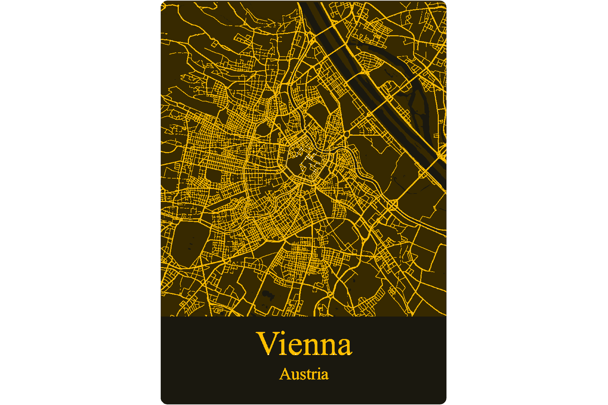

[![GitHub Release][releases-shield]][releases]
[![License][license-shield]](LICENSE)

[![Project Maintenance][maintenance-shield]][maintenance]
[![BuyMeCoffee][buymecoffee-shield]][buymecoffee]

# Printed City Board

This is Printed City Board, a beautiful electronic board.

## Cities

      

## Project tree common for any city map

<li>Design</li>
<li>Documentation</li>
<li>Production</li>

[releases-shield]: https://img.shields.io/github/release/JGAguado/PrintedCityBoard.svg?style=for-the-badge
[releases]: https://github.com/JGAguado/PrintedCityBoard/releases

[license-shield]: https://img.shields.io/github/license/JGAguado/PrintedCityBoard.svg?style=for-the-badge

[maintenance-shield]: https://img.shields.io/badge/maintainer-J.%20G.%20Aguado-blue.svg?style=for-the-badge
[maintenance]: https://github.com/JGAguado

[buymecoffee-shield]: https://img.shields.io/badge/buy%20me%20a%20coffee-support-yellow.svg?style=for-the-badge
[buymecoffee]: https://www.buymeacoffee.com/J.G.Aguado
